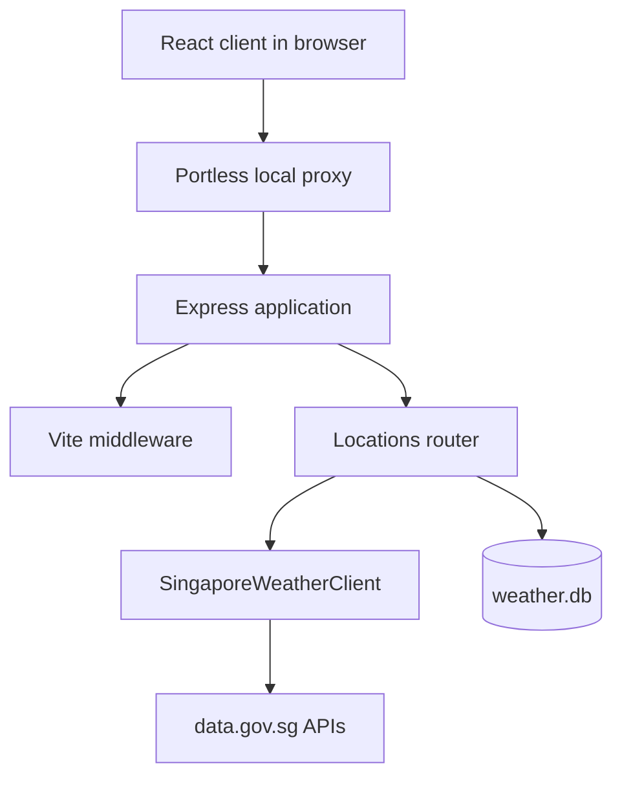
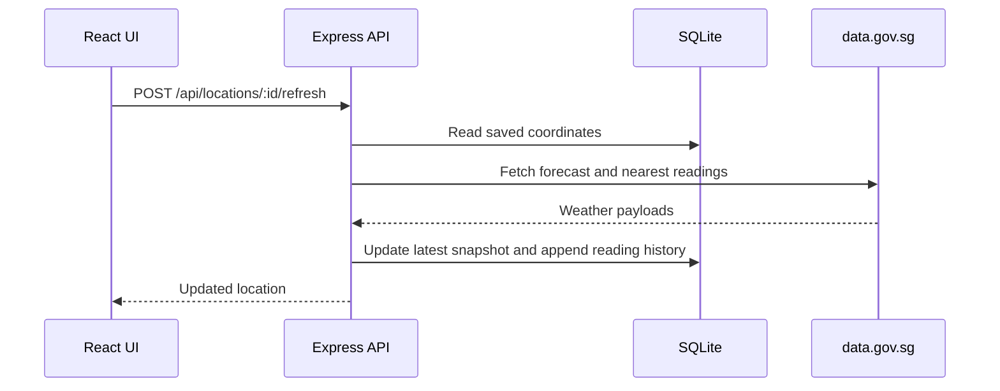

## Runtime topology

The backend is a Node.js and Express application. In development it mounts Vite middleware, so the browser uses one origin for both the dashboard and its API calls. The React client requests relative `/api` paths and does not need a separately configured backend URL.

## Location refresh flow

The application uses a snapshot pattern: normal location reads come from SQLite rather than calling the weather provider on every page load.

When a new location is created, the server first saves it with a placeholder snapshot, then attempts the same refresh flow. If the provider is unavailable, creation still succeeds and the location remains available for a later refresh.

## Frontend state

`StoreProvider` loads locations on mount and owns the selected location, loading state, refresh state, and API errors. The dashboard route renders the layout; `/locations/:id` renders the location-history view. UI interactions call the API client, then reload the location list to synchronize the React state with persisted order and primary-location changes.

## Observability

The Express app exposes `GET /health` and uses Pino HTTP logging. The React API client also sends interaction events to `POST /api/logs`; the server validates the event name and logs it without persisting it.
