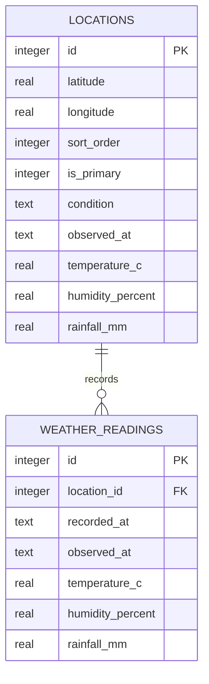

SQLite is stored at `backend/weather.db` unless `DATABASE_PATH` overrides it. Drizzle applies the migrations in `backend/drizzle/` when the database module initializes.

## `locations`

Each row represents one saved latitude and longitude pair. A unique index prevents duplicate coordinate pairs. The row stores the latest weather snapshot, including current condition, forecast data, nearest-station readings, air-quality fields, and serialized forecast-period and daily-forecast arrays.

`is_primary` controls which location appears first. `sort_order` determines the order of other locations.

## `weather_readings`

Each successful refresh appends a reading containing the recorded time, provider-observed time, temperature, rainfall, and humidity. The history endpoint returns this data in chronological order.

The database retains at most 1,000 readings per location. Refreshing updates the latest snapshot and inserts a history row in one transaction.
