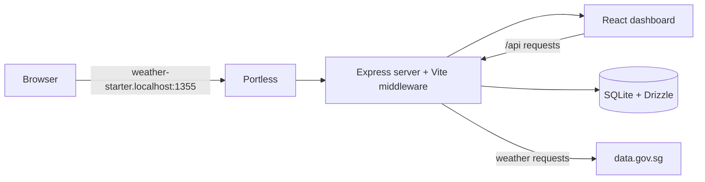
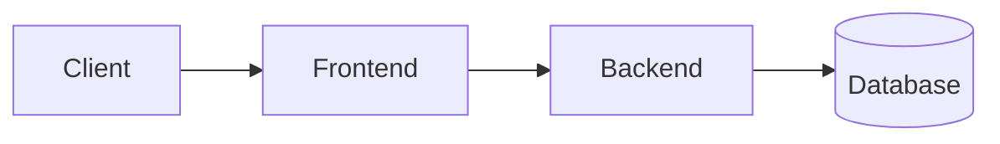

Weather Starter is a TypeScript application that saves Singapore locations, retrieves weather data from data.gov.sg, and displays the latest snapshot alongside its history.

## What it does

- Saves locations within Singapore and keeps one location marked as primary.
- Fetches forecasts and nearby station readings from data.gov.sg.
- Persists the latest snapshot and a bounded history of temperature, humidity, and rainfall readings.
- Supports refresh, deletion, reordering, and location-history views.

Use the guide to run the app, understand the request flow, and work with the API and storage model.

